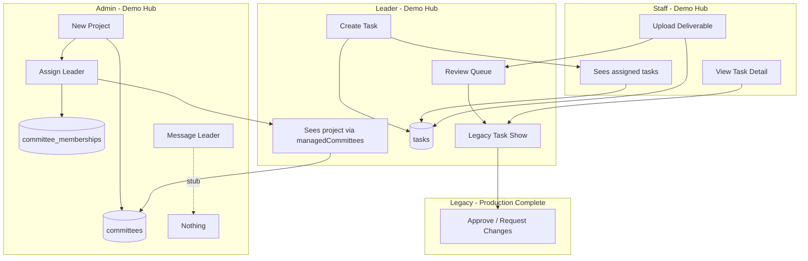

# TeamHUB — Optimization & Workflow Audit

> Generated audit of what to optimize, which buttons work, and whether the full project → leader → task → staff flow completes end-to-end.

---

## Quick verdict

| Path | Full workflow works? |
|------|---------------------|
| **Demo walkthrough** (default local setup, `DEMO_QUICK_LOGIN=true`) | **Mostly yes** on the pre-seeded demo project; **partially broken** on brand-new admin-created projects |
| **Production / legacy** (`/clubs/.../committees/...`) | **Yes** — create project, assign roles, create tasks, staff deliverable, leader review are all wired and tested |
| **Team Hub alone** (without legacy pages) | **No** — hub is a dashboard shell; approve/review and full task management still redirect to legacy routes |

Automated tests passing for core legacy flows: `TaskCrudTest`, `TaskDeliverableTest`, `TeamHubRoutesTest` (16+ assertions on project/task CRUD and deliverables).

---

## End-to-end workflow: does it actually work?

### The flow you asked about

```
Admin creates project → assigns leader → leader sees project → leader assigns task → staff sees task
```

### Scenario A — Demo quick-login (recommended walkthrough)

Use the three demo accounts from the entry screen:

| Role | Email |
|------|-------|
| Admin | `admin@teamhub.test` |
| Project leader | `project-leader@teamhub.test` |
| Staff | `staff@teamhub.test` |

**Pre-seeded demo project** (`لجنة إدارة المشاريع` in workspace `نادي الحاسبات`):

1. Log in as **admin** → dashboard shows admin panel with all projects.
2. Log in as **project leader** → bootstrap (`DemoWalkthroughBootstrap`) ensures lead role + sample tasks; leader panel shows the demo project, team, and review queue.
3. Log in as **staff** → bootstrap ensures member role + assigned sample tasks; staff panel lists tasks immediately.

**This path works end-to-end** including deliverable upload (hub) and approve/request-changes (legacy task detail page).

### Scenario B — Admin creates a *new* project in demo mode

| Step | Works? | Notes |
|------|--------|-------|
| Admin clicks **New project** → submits form | ✅ | `POST /hub/admin/projects` → creates `Committee` record |
| Admin assigns leader at create time OR via **Assign leader** form | ✅ | Sets `CommitteeLead` role on `CommitteeMembership` |
| Leader logs in and sees the new project | ✅ | `User::managedCommittees()` picks up lead role; leader panel renders project card |
| Leader assigns task to staff from hub form | ⚠️ **Broken UX** | Assignee dropdown only lists **other committee members**. Staff is **not auto-added** to new projects, so the dropdown is often **empty** |
| Staff sees newly assigned task | ⚠️ **Conditional** | Staff sees tasks via `Task::assignedTo($user)` on hub dashboard. If leader could not pick staff (empty dropdown), task stays unassigned and staff sees nothing |
| Staff opens task detail | ⚠️ | `TaskPolicy::view` requires committee membership. Assigned staff who are **not** project members get **403** on legacy task page |
| Staff submits deliverable from hub | ✅ | Hub route checks `isAssignedTo` only, not membership |
| Leader approves deliverable from hub | ❌ | No approve UI in hub; must open legacy `/clubs/.../tasks/{id}` |

### Scenario C — Production (`DEMO_QUICK_LOGIN=false`)

Hub mutation buttons (**New project**, **Assign leader**, **Create task**, **Upload deliverable** on hub dashboard) all return **404** — they are demo-only (`TeamHubDemoController::assertPersona`).

Production users must use:

| Action | Route / UI |
|--------|------------|
| Create project | `/clubs/{club}/committees/create` |
| Assign leader / members | Project **Manage** → `CommitteeMemberController` |
| Create & assign tasks | `/clubs/{club}/committees/{committee}/tasks` |
| Staff my work | `/my-tasks` (students) or `/hub/tasks` |
| Submit deliverable | Task detail → `POST .../deliverable` |
| Approve / request changes | Task detail → `POST .../approve` or `.../request-changes` |

**This path is complete and tested** (`TaskCrudTest`, `TaskDeliverableTest`).

---

## Button & action audit

### Team Hub dashboard (demo personas)

| Button / action | Route | Status | Issue |
|-----------------|-------|--------|-------|
| **New project** (admin) | `POST /hub/admin/projects` | ✅ Works (demo only) | Creates DB record; optional leader at create time |
| **Assign leader** (admin) | `POST /hub/admin/assign-leader` | ✅ Works (demo only) | Only accepts users with `project_leader` demo role email |
| **Message leader** (admin) | `POST /hub/admin/message-leader` | ⚠️ **Stub** | Shows success toast; **no notification, email, or DB write** |
| **Create task** (leader) | `POST /hub/leader/tasks` | ✅ Works (demo only) | Skips activity log + assignment notifications (unlike legacy) |
| **View tasks / Manage** (leader) | Legacy committee routes | ✅ | Links out to legacy UI |
| **View deliverable** (leader review queue) | Legacy task show | ✅ | Approve happens on legacy page, not hub |
| **Upload deliverable** (staff) | `POST /hub/staff/deliverables/{task}` | ✅ Works (demo only) | Full submit flow via `Task::submitDeliverable()` |
| **View task** (staff) | Legacy task show | ⚠️ | 403 if staff not a committee member |

### Team Hub navigation & pages

| Button / action | Status | Issue |
|-----------------|--------|-------|
| Sidebar nav (Home, Projects, Tasks, etc.) | ✅ | Real routes, no `#` placeholders |
| **Settings** icon (sidebar footer) | ❌ **Dead** | `aria-label` only — no `href` or handler |
| Theme toggle | ✅ | Client-side |
| Demo role switcher | ✅ | `POST /demo-login` |
| Projects → **New project** | ✅ | Links to legacy `committees.create` |
| Projects → project card click | ✅ | Legacy tasks index |
| Tasks → search / status filters | ✅ | Query params on `/hub/tasks` |
| Tasks table **checkboxes** | ❌ **Decorative** | `preventDefault()` — does nothing |
| Dashboard search | ✅ | Redirects to `/hub/tasks?q=...` |
| Notifications bell | ✅ | `/notifications` |

### Legacy project management (production-complete)

| Area | Status |
|------|--------|
| Task create / edit / delete | ✅ |
| Status transitions (todo → in progress) | ✅ |
| Deliverable submit (file, link, notes) | ✅ |
| Approve / request changes | ✅ |
| Comments | ✅ |
| Member add / remove / role change | ✅ |
| Project files, updates, reports | ✅ |

### Orphaned / preview-only UI

| File | Status |
|------|--------|
| `resources/js/pages/team-hub/Deliverable.svelte` | ❌ Hardcoded demo data, not routed in live app |

---

## What to optimize (prioritized)

### P0 — Fix broken or incomplete workflows

1. **Auto-add staff (or all workspace members) when creating a demo project**  
   New projects have no members except the leader → leader cannot assign tasks from the hub dropdown.  
   *Files:* `TeamHubDemoController::storeProject`, `DemoWalkthroughBootstrap`

2. **Unify hub mutations for production**  
   Move demo-only logic into shared services; use policies instead of `assertPersona` + 404.  
   *File:* `app/Http/Controllers/TeamHub/TeamHubDemoController.php`

3. **Hub task create should match legacy side effects**  
   Call `recordCreated()` and `recordAssignment()` so staff get notifications.  
   *Compare:* `TeamHubDemoController::storeTask` vs `TaskController::store`

4. **Wire or remove dead buttons**  
   - Sidebar **Settings** → link to `/settings/profile`  
   - **Message leader** → implement notification or remove UI  
   - **Tasks table checkboxes** → bulk actions or remove

5. **Leader approve/review inside hub**  
   Today leaders must leave hub to approve deliverables on legacy task show page.

### P1 — Performance

| Area | Problem | Suggestion |
|------|---------|------------|
| `TeamHubData::kpis()` | Clones task query 4+ times | Single aggregated query or one `get()` + in-memory counts |
| `accessibleCommitteeIds()` | Multiple pluck/merge per request | Memoize per request on `TeamHubData` |
| Hub `/projects`, `/hub/tasks` | No pagination | Add pagination (component exists at `components/ui/pagination`) |
| `leaderPanel` | Loads all committee tasks | Limit or paginate |
| `adminPanel` | Loads all committees globally | Scope to accessible workspaces in production |
| Search | `LIKE '%term%'` | Full-text index when data grows |
| Notifications badge | Count query on every Inertia request | Cache per request / defer to client poll |

### P2 — Architecture & UX polish

1. **Single presenter layer** — `TeamHubData`, `TeamHubDashboardPresenter`, and `TaskController` mappers duplicate task/project shaping; extract shared presenters.
2. **Complete hub task UX** — Embed create/show/review in hub layout instead of context-switching to `ProjectManageShell`.
3. **Consolidate home routing** — All authenticated users → `/hub/dashboard` with role panels (today university staff default to Filament).
4. **Leader panel shows only first managed project** — `managedCommittees()->first()` ignores additional projects; add project switcher.
5. **Validate assignee on hub task create** — Legacy `StoreTaskRequest` enforces committee membership; hub demo does not.
6. **i18n consistency** — Hardcoded `مهام` in `AdminDashboardPanel.svelte`; mixed Arabic/translation keys.
7. **Dark mode** — Forced light mode deferred in `PHASE_7_POLISH_NOTES.md`.
8. **Brand theme on task pages** — `TaskController` missing workspace theme props (also in Phase 7 notes).
9. **Frontend bundle** — Route-level code splitting for hub vs legacy layouts.
10. **Eager-load standard** — Define `Task::hubListRelations()` used everywhere tasks are listed.

### P3 — Testing gaps

No automated test covers the full demo chain:

```
admin storeProject → assignLeader → leader dashboard → storeTask → staff dashboard
```

Recommend adding `tests/Feature/TeamHubDemoWorkflowTest.php` to lock the walkthrough.

---

## Workflow diagram (current state)



**Gaps:** `A3` stub; new projects missing staff membership; hub has no approve; legacy required for review.

---

## Recommended manual test script (5 minutes)

With `DEMO_QUICK_LOGIN=true` and `composer dev` running:

1. Open `/` → click **Admin** → confirm project list loads.
2. Create project **"Test Alpha"** with leader **project-leader@teamhub.test**.
3. Switch to **Project leader** → confirm **Test Alpha** appears (or demo project if leader has multiple — known limitation: only first project shown).
4. Create task titled **"Staff assignment test"** — if assignee dropdown is empty, this confirms the membership gap.
5. Switch to **Staff** → confirm assigned tasks appear (demo bootstrap tasks should always show; new task only if step 4 succeeded).
6. Click **Upload deliverable** on an in-progress task → submit link → confirm status moves to **Review**.
7. Switch to **Leader** → open **View deliverable** → on legacy page click **Approve** → confirm **Done**.

For production path, repeat steps 4–7 via `/clubs/{club}/committees/{committee}/tasks` with real accounts.

---

## Key files reference

| Concern | Path |
|---------|------|
| Demo actions | `app/Http/Controllers/TeamHub/TeamHubDemoController.php` |
| Dashboard data | `app/Support/TeamHub/TeamHubDashboardPresenter.php` |
| Demo bootstrap | `app/Support/DemoWalkthroughBootstrap.php` |
| Legacy task CRUD | `app/Http/Controllers/TaskController.php` |
| Task authorization | `app/Policies/TaskPolicy.php` |
| Admin panel UI | `resources/js/components/team-hub/dashboard/AdminDashboardPanel.svelte` |
| Leader panel UI | `resources/js/components/team-hub/dashboard/ProjectLeaderDashboardPanel.svelte` |
| Staff panel UI | `resources/js/components/team-hub/dashboard/StaffDashboardPanel.svelte` |
| Routes | `routes/web.php` |
| Existing polish backlog | `PHASE_7_POLISH_NOTES.md` |
| Deploy checklist | `VALIDATION_READINESS_CHECKLIST.md` |

---

## Summary

- **Legacy/production workflow is solid** — projects, roles, tasks, deliverables, and review are implemented and tested.
- **Demo hub walkthrough works on the pre-seeded project** but **breaks assignment UX on newly created projects** because staff are not added as members.
- **Several hub buttons are stubs or decorative** (settings, message leader, task checkboxes).
- **Hub cannot complete the review step** — leaders must use legacy task pages to approve.
- **Biggest wins:** fix new-project membership, unify demo/production mutations, add hub review UI, paginate lists, and add an end-to-end demo workflow test.
