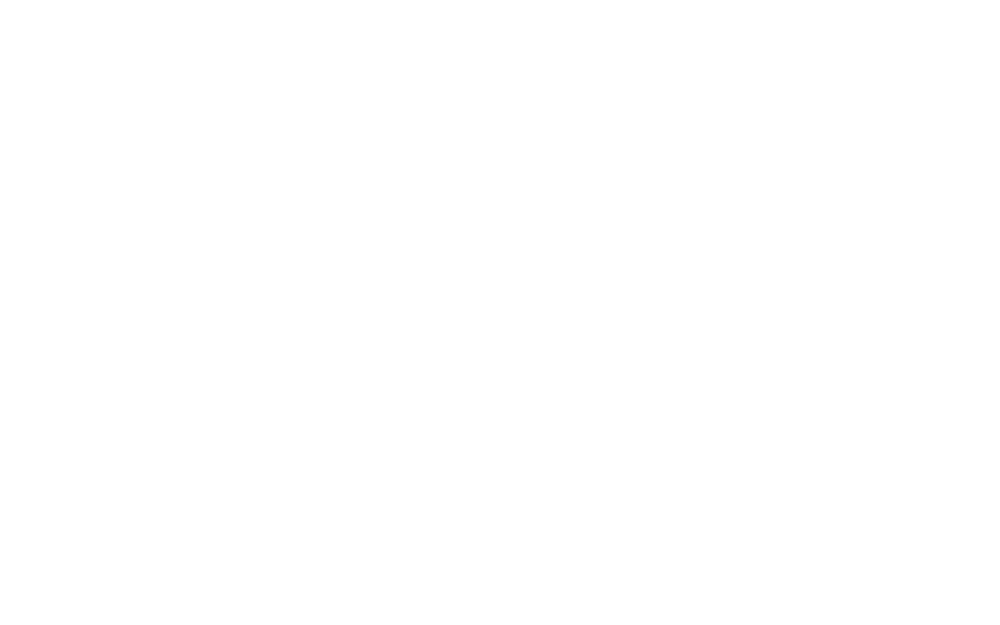
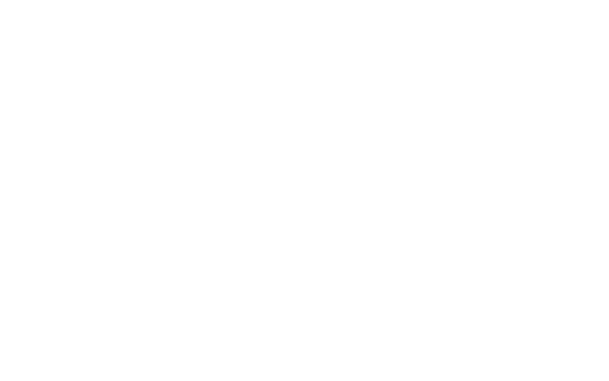
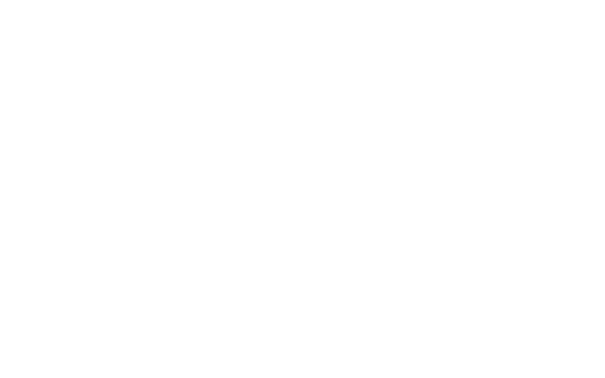
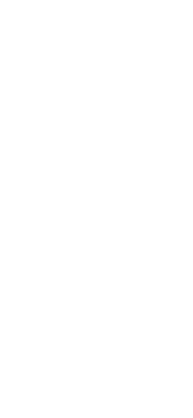
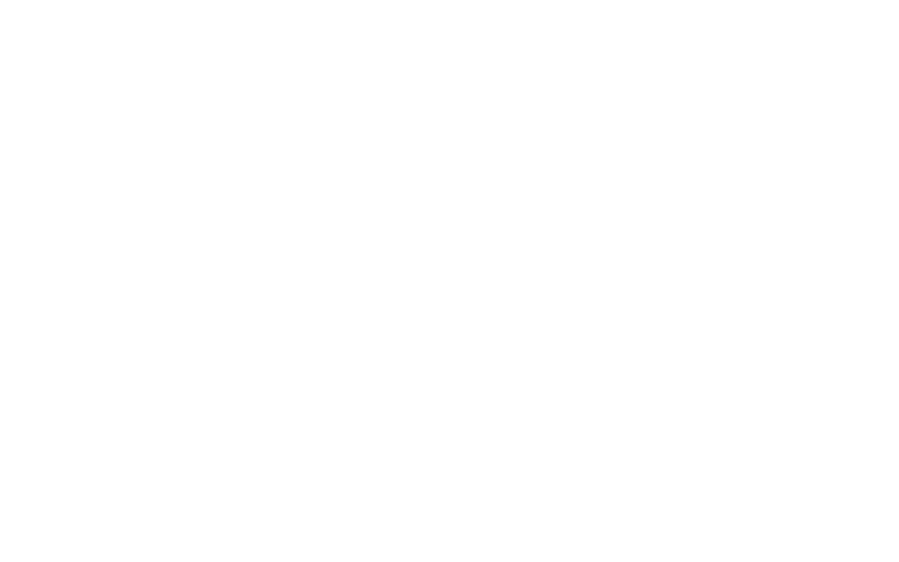

<p align="center">
  
</p>

<h1 align="center">TeamHUB</h1>

<p align="center">
  <strong>Arabic-first teamwork platform for small organizations</strong><br />
  Workspaces, projects, tasks, deliverables, and review — in one place.
</p>

<p align="center">
  <a href="https://github.com/Alkabkabi1/TeamHUB/actions/workflows/tests.yml"></a>
  <a href="./LICENSE"></a>
  <a href="https://github.com/Alkabkabi1/TeamHUB/releases/tag/v1.0.0-rc1"></a>
</p>

<p align="center">
  <a href="https://github.com/Alkabkabi1/TeamHUB/releases/tag/v1.0.0-rc1"><strong>v1.0.0-rc1</strong></a>
  ·
  <a href="./TEAMHUB_USER_GUIDE.md">User guide</a>
  ·
  <a href="./RELEASE_CHECKLIST.md">Deploy</a>
  ·
  <a href="./docs/README.md">Documentation</a>
</p>

---

## Screenshots

| Task list (Arabic, RTL) | Task detail & review |
| --- | --- |
|  |  |

| My work | Mobile task list | English locale |
| --- | --- | --- |
|  |  |  |

> Live demo URL: add your staging link here after Phase 8 deploy.

---

## What this is

TeamHUB is a **standalone, Arabic-first platform for team and project work** aimed at NGOs, Arabic-speaking startups, and small program teams.

It began as a **re-engineering** of the [Ruwad](https://github.com/Weaam-02/ruwad) university-clubs codebase into a generic teamwork product built around **Workspace → Project → Task**. See [NOTICE](./NOTICE) for attribution.

### One-line pitch

**Arabic-first teamwork where completing a task means submitting real output and getting lead approval — not checking a box.**

### Core capabilities

| Area | What you get |
| --- | --- |
| **Workspaces & projects** | Organization container + delivery teams |
| **Tasks** | Assignee, due date, priority, status, comments, activity |
| **Deliverables** | File, link, or notes when work is submitted for review |
| **Review workflow** | `Todo` → `In Progress` → `Review` → `Done` |
| **My work** | Cross-project view of tasks assigned to you |
| **AI assistant** | Task-aware tools with confirm-before-write mutations |
| **Arabic / English** | Bilingual UI with RTL support |

---

## Quick start

```bash
git clone https://github.com/Alkabkabi1/TeamHUB.git
cd TeamHUB
composer setup
composer dev
```

On Windows, run `php artisan serve` and `npm run dev` in separate terminals instead of `composer dev`.

Copy `.env.example` to `.env`. Local defaults use SQLite at `database/database.sqlite`:

```powershell
ni database/database.sqlite -ItemType File
```

| Command | Purpose |
| --- | --- |
| `composer test` | Lint + Pest (339 tests) |
| `composer ci:check` | Full CI gate |
| `composer analyse` | PHPStan static analysis |

### Demo login

When `DEMO_QUICK_LOGIN=true` (local default), open `/` and pick a demo role. **Disable in production** (`DEMO_QUICK_LOGIN=false`).

---

## Tech stack

| Layer | Technology |
| --- | --- |
| Backend | Laravel 13 (PHP 8.4) |
| Runtime | Laravel Octane + RoadRunner |
| Frontend | Inertia.js v3 + Svelte 5 |
| Styling | Tailwind CSS v4 |
| Admin | Filament v4 |
| Auth | Laravel Fortify |
| AI | Laravel AI SDK |
| Testing | Pest v4 + PHPStan |

---

## Deploy

Production profile: **Linux VPS**, **PHP 8.4**, **Octane/RoadRunner**, **Redis**, **PostgreSQL 15+** (or MySQL 8+).

1. [RELEASE_CHECKLIST.md](./RELEASE_CHECKLIST.md) — pre-deploy cutover
2. [deploy/deploy.sh](./deploy/deploy.sh) — build, migrate, cache, Octane reload
3. [PRODUCTION_VERIFICATION_CHECKLIST.md](./PRODUCTION_VERIFICATION_CHECKLIST.md) — post-deploy QA

Example nginx, Supervisor, and systemd units: [deploy/examples/](./deploy/examples/).

---

## Documentation

| Audience | Start here |
| --- | --- |
| **Users** | [TEAMHUB_USER_GUIDE.md](./TEAMHUB_USER_GUIDE.md) |
| **Operators** | [OPERATIONS_RUNBOOK.md](./OPERATIONS_RUNBOOK.md) |
| **Contributors** | [CONTRIBUTING.md](./CONTRIBUTING.md) |
| **Engineers** | [docs/README.md](./docs/README.md) |

---

## Roadmap

| Phase | Focus | Status |
| --- | --- | --- |
| **0–7** | Vision → domain → polish → `v1.0.0-rc1` | Done |
| **8** | Deploy & pilot | In progress |
| **9** | v2 backlog (Kanban, subtasks, etc.) | Planned from pilot feedback |

Release history: [CHANGELOG.md](./CHANGELOG.md)

---

## Contributing

Contributions welcome. Read [CONTRIBUTING.md](./CONTRIBUTING.md), [SECURITY.md](./SECURITY.md), and [CODE_OF_CONDUCT.md](./CODE_OF_CONDUCT.md) before opening a PR.

---

## Attribution

Based on [Ruwad](https://github.com/Weaam-02/ruwad), MIT License. See [NOTICE](./NOTICE) and [LICENSE](./LICENSE).

For the original pivot planning notes and legacy mapping tables, see [PLATFORM_REUSE_AND_PIVOT_PLAN.md](./PLATFORM_REUSE_AND_PIVOT_PLAN.md).
