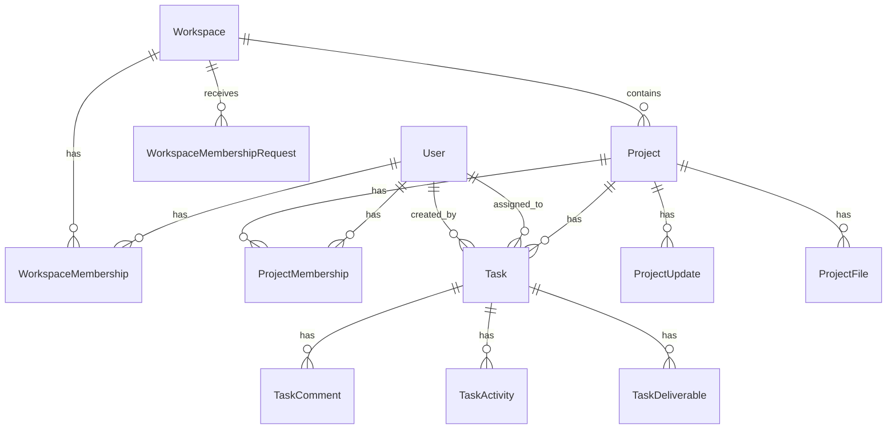

# TeamHUB — Domain Model

**Status:** Phase 3.5 complete — repository cleaned; runtime uses canonical Workspace / Project / Task vocabulary throughout.  
**Note:** Historical database migrations may still reference legacy table/column names (`clubs`, `committees`, `club_id`, etc.) from the domain re-engineering migration.

---

## Overview

TeamHUB organizes work in three layers:

```
Workspace  →  Project  →  Task  →  Deliverable
     │            │
     │            ├── ProjectFile
     │            ├── ProjectUpdate
     │            └── ProjectMembership
     │
     ├── WorkspaceMembership
     └── WorkspaceMembershipRequest
```

---

## Entity diagram



---

## Core entities

### User

A person who can belong to workspaces and projects.

| Field / concept | Notes |
|-----------------|-------|
| Global role | `member` or `admin` (platform administrator) |
| Locale | Preferred language (`ar`, `en`) |
| Auth | Email, password, optional 2FA (Fortify) |

**Not in domain:** university affiliation, student ID, attendance QR token.

---

### Workspace

The top-level **organization** container (company, NGO, community).

| Responsibility | Examples |
|----------------|----------|
| Branding | Name, theme color, logo |
| Membership | Who belongs to the organization |
| Projects | All projects live under a workspace |

**Legacy mapping:** `Club` → `Workspace`  
**Table (target):** `workspaces`

**Removed fields (target):** `category`, `college`, `university_id`

---

### WorkspaceMembership

Links a user to a workspace with a status and roles.

| Attribute | Values |
|-----------|--------|
| Status | e.g. `pending`, `approved`, `rejected` |
| Roles | `WorkspaceRole` — e.g. workspace lead, membership manager |

---

### WorkspaceMembershipRequest

A user requests to join a workspace; leads approve or reject.

**Legacy mapping:** `ClubJoinApplication` (generalized — no academic major/level fields).

---

### Project

A focused team effort inside a workspace (product launch, campaign, internal initiative).

| Responsibility | Examples |
|----------------|----------|
| Tasks | Task list and workflow |
| Members | Project-scoped roles |
| Files | Shared project files |
| Updates | Announcements / progress posts |

**Legacy mapping:** `Committee` → `Project`  
**Table (target):** `projects`  
**FK:** `workspace_id`

---

### ProjectMembership

Links a user to a project with roles.

| Role examples | Capabilities |
|---------------|--------------|
| Project lead | Manage tasks, members, approve deliverables |
| Member | Work on assigned tasks |
| Content manager | Project updates (optional) |

**Legacy mapping:** `CommitteeMembership` + `CommitteeRole` → `ProjectMembership` + `ProjectRole`

---

### Task

Unit of assignable work.

| Attribute | Notes |
|-----------|-------|
| Title, description | Required text |
| Status | See lifecycle below |
| Priority | low, medium, high, urgent |
| Due date | Optional |
| Assignee | Optional `User` |
| Creator | `User` who created the task |

**FK:** `project_id`  
**Legacy mapping:** `committee_id` → `project_id`

---

### Task lifecycle (target)

| Status | Meaning |
|--------|---------|
| `draft` | Not yet visible/actionable for the team |
| `todo` | Ready to start |
| `in_progress` | Actively being worked on |
| `in_review` | Deliverable submitted; awaiting lead review |
| `changes_requested` | Lead rejected; assignee must revise |
| `completed` | Deliverable approved |

**Current codebase (pre-Phase 3):** `todo`, `in_progress`, `review`, `done` — will be migrated.

---

### TaskDeliverable

Evidence of completed work attached to a task.

| Type | Storage |
|------|---------|
| Files | One or more files (media library or `task_deliverables`) |
| Link | URL (Figma, Drive, GitHub, etc.) |
| Notes | Text summary |

Submitting a deliverable moves the task to `in_review`. Approval moves to `completed`; rejection moves to `changes_requested`.

---

### TaskComment

User comment on a task. Supports `@mentions` (target) for notifications.

---

### TaskActivity

Immutable audit log: created, assigned, status changed, deliverable submitted, approved, comment added, etc.

---

### ProjectFile

File stored at project level (shared assets, references).

**Legacy mapping:** `ClubResource` → `ProjectFile`  
**Table (target):** `project_files`

---

### ProjectUpdate

Short post or announcement on a project.

**Legacy mapping:** `Post` → `ProjectUpdate`  
**Table (target):** `project_updates`

---

## Platform administration

### Admin (`UserRole::Admin`)

Platform-level operator (Filament panel): users, workspaces, projects, tasks — not scoped to a single university.

**Legacy mapping:** `UniversityStaff` → `Admin`

---

## Authorization model (summary)

| Resource | Typical rules |
|----------|----------------|
| Workspace | Members see their workspaces; leads manage settings and membership |
| Project | Project members see project; leads manage tasks and members |
| Task | Members + assignee can view; assignee can submit deliverable; lead can approve |
| Deliverable | Governed by task policies |

Workspace **isolation:** users must not read or mutate workspaces they do not belong to (except platform admin).

Detailed policy implementation: Phase 7 of re-engineering.

---

## Entities removed from domain

These do **not** exist in the target TeamHUB product:

| Removed | Reason |
|---------|--------|
| University | Academic tenancy — not generic team SaaS |
| Event, EventAttendance, AttendanceCheckin | Event/attendance — university-specific |
| Certificate, CertificateTemplate | Academic credentials |
| VolunteerHour | Academic/volunteer reporting |
| Tag / public catalog | University club discovery |
| Academic PDF reports | Replaced by generalized team reports (Phase 6) |

---

## Legacy → target rename table

| Legacy (codebase today) | Target |
|-------------------------|--------|
| `Club` | `Workspace` |
| `club_id` | `workspace_id` |
| `ClubMembership` | `WorkspaceMembership` |
| `ClubRole` | `WorkspaceRole` |
| `ClubJoinApplication` | `WorkspaceMembershipRequest` |
| `Committee` | `Project` |
| `committee_id` | `project_id` |
| `CommitteeMembership` | `ProjectMembership` |
| `CommitteeRole` | `ProjectRole` |
| `Post` | `ProjectUpdate` |
| `ClubResource` | `ProjectFile` |
| `UserRole::Student` | `UserRole::Member` |
| `UserRole::UniversityStaff` | `UserRole::Admin` |

---

## Route model (target URLs)

| Area | Path |
|------|------|
| Dashboard | `/dashboard` |
| Workspaces | `/workspaces`, `/workspaces/{workspace}` |
| Workspace members | `/workspaces/{workspace}/members` |
| Workspace settings | `/workspaces/{workspace}/settings` |
| Projects | `/projects`, `/projects/{project}` |
| Project sub-resources | `/projects/{project}/members`, `/files`, `/updates`, `/activity` |
| Tasks | `/tasks`, `/tasks/{task}` |
| My tasks | `/tasks?mine=1` |
| Notifications | `/notifications` |
| Settings | `/settings/profile`, `/settings/security` |

No long-term `/clubs/*`, `/committees/*`, or `/hub/*` prefixes.

---

## Related documents

- [PRODUCT_VISION.md](./PRODUCT_VISION.md) — why this model exists
- [ENGINEERING_PRINCIPLES.md](./ENGINEERING_PRINCIPLES.md) — how to implement changes safely
